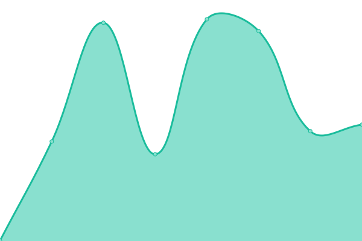

# [📈 Live Status](https://demo.upptime.js.org): <!--live status--> **🟩 All systems operational**

This repository contains the open-source uptime monitor and status page for [Manil Chowdhury](https://manil.xyz), powered by [Upptime](https://github.com/upptime/upptime).

With [Upptime](https://upptime.js.org), you can get your own unlimited and free uptime monitor and status page, powered entirely by a GitHub repository. We use [Issues](https://github.com/keywordnew/scaling-robot/issues) as incident reports, [Actions](https://github.com/keywordnew/scaling-robot/actions) as uptime monitors, and [Pages](https://demo.upptime.js.org) for the status page.

<!--start: status pages-->
<!-- This summary is generated by Upptime (https://github.com/upptime/upptime) -->
<!-- Do not edit this manually, your changes will be overwritten -->
<!-- prettier-ignore -->
| URL | Status | History | Response Time | Uptime |
| --- | ------ | ------- | ------------- | ------ |
|  [City of Vancouver](https://vancouver.ca/home-property-development/water-treatment.aspx) | 🟩 Up | [city-of-vancouver.yml](https://github.com/neighbourhood-cyber/scaling-robot/commits/HEAD/history/city-of-vancouver.yml) | 

 522ms
     
 | 

<a href="https://keywordnew.github.io/scaling-robot/history/city-of-vancouver">100.00%</a>
    

|  [BC Hydro](https://www.bchydro.com/) | 🟩 Up | [bc-hydro.yml](https://github.com/neighbourhood-cyber/scaling-robot/commits/HEAD/history/bc-hydro.yml) | 

 316ms
     
 | 

<a href="https://keywordnew.github.io/scaling-robot/history/bc-hydro">100.00%</a>
    

|  [Telus](https://www.telus.com/en) | 🟩 Up | [telus.yml](https://github.com/neighbourhood-cyber/scaling-robot/commits/HEAD/history/telus.yml) | 

 2541ms
     
 | 

<a href="https://keywordnew.github.io/scaling-robot/history/telus">100.00%</a>
    

|  [Vancouver General Hospital](https://www.vch.ca/en/location/vancouver-general-hospital) | 🟩 Up | [vancouver-general-hospital.yml](https://github.com/neighbourhood-cyber/scaling-robot/commits/HEAD/history/vancouver-general-hospital.yml) | 

 2644ms
     
 | 

<a href="https://keywordnew.github.io/scaling-robot/history/vancouver-general-hospital">100.00%</a>
    

|  [Vancouver Police Department](https://vpd.ca/report-a-crime/) | 🟩 Up | [vancouver-police-department.yml](https://github.com/neighbourhood-cyber/scaling-robot/commits/HEAD/history/vancouver-police-department.yml) | 

 152ms
     
 | 

<a href="https://keywordnew.github.io/scaling-robot/history/vancouver-police-department">100.00%</a>
    

|  [Translink](https://www.translink.ca/) | 🟩 Up | [translink.yml](https://github.com/neighbourhood-cyber/scaling-robot/commits/HEAD/history/translink.yml) | 

 120ms
     
 | 

<a href="https://keywordnew.github.io/scaling-robot/history/translink">100.00%</a>
    

|  [Vancity](https://www.vancity.com/) | 🟩 Up | [vancity.yml](https://github.com/neighbourhood-cyber/scaling-robot/commits/HEAD/history/vancity.yml) | 

 450ms
     
 | 

<a href="https://keywordnew.github.io/scaling-robot/history/vancity">100.00%</a>
    

<!--end: status pages-->

[**Visit our status website →**](https://demo.upptime.js.org)

## 📄 License

- Powered by: [Upptime](https://github.com/upptime/upptime)
- Code: [MIT](./LICENSE) © [Manil Chowdhury](https://manil.xyz)
- Data in the `./history` directory: [Open Database License](https://opendatacommons.org/licenses/odbl/1-0/)
